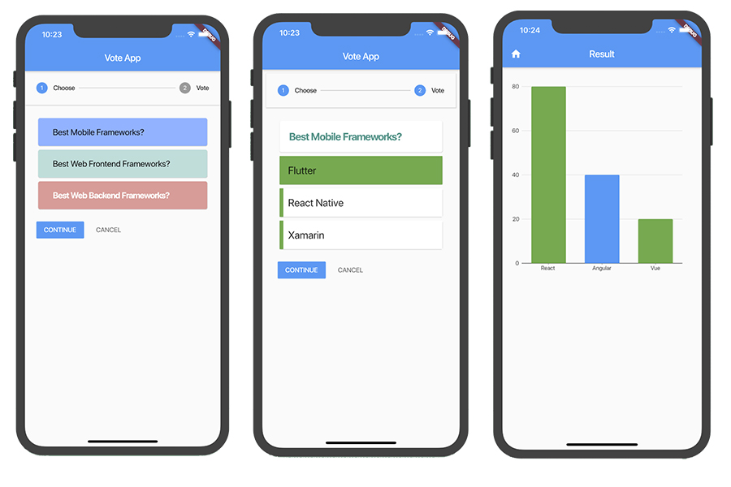
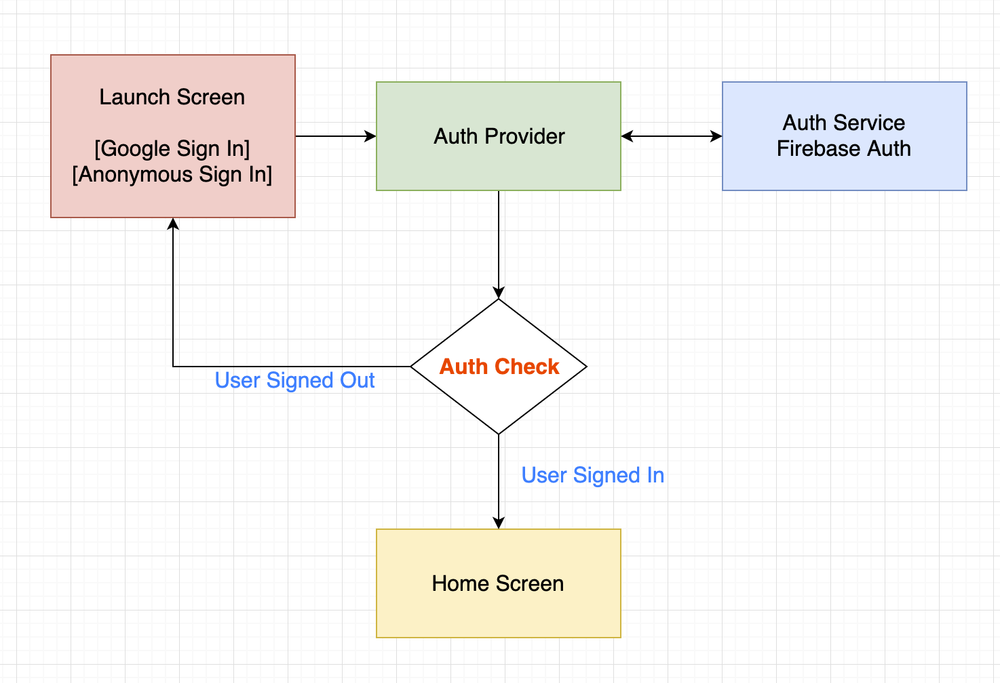
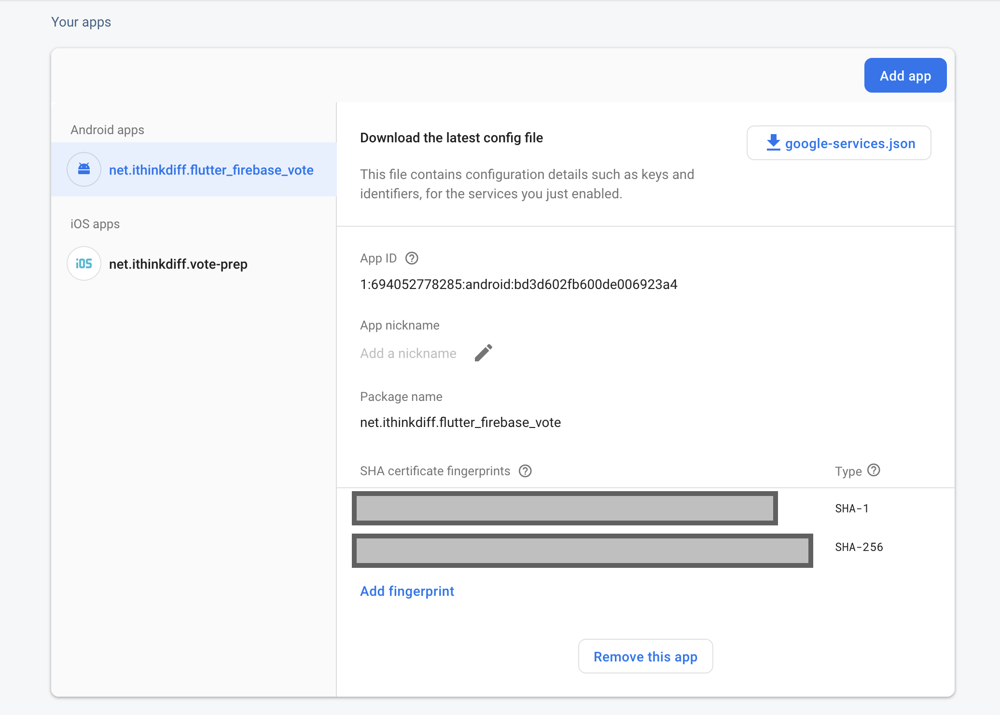

<p align="center">
    
</p>
<p align="center">
    <a href="https://www.youtube.com/channel/UCtHlgyUw0wLE5Ous9swfFlg">
        
    </a>
    <a href="https://ithinkdiff.net/">
        
    </a>
    <a href="https://twitter.com/mahmudahsan">
        
    </a>
</p>


# Vote - A full Flutter Application
- [Video Tutorial 1: Building the app](https://www.youtube.com/watch?v=Iu9DpbzR83s)
- [Video Tutorial 2: Add Firebase Authentication and Firestore Database](https://youtu.be/N6DF-zz9c6o)
- [Video Tutorial 3: Migrating Provider 4.0 and Fix Android Firebase Authentication issues](https://www.youtube.com/watch?v=8W8zT0MKLWk)

> - [Migration to Provider 4.0](#migration-to-provider-4)
> - [Firebase configuration for android](#firebase-configuration-for-android)

> A flutter and firebase based vote application. 
For state management we used, [Provider](https://pub.dev/packages/provider). 

> If you need to know how to use [Provider](https://pub.dev/packages/provider), please
> - [How to use Provider 3.0](https://www.youtube.com/watch?v=fEIdWV8MAso)
> - [Migrating Provider 3 to 4](https://youtu.be/xR-2rM_99-E)

### Demo 2.0

<p align="center">
    
</p>

<p align="center">
    
</p>

### Features and Updates
> Version 3.0
> 1. Provider library updated to version 4.0
> 2. All other 3rd party libraries updated
> 3. All related app code updated to support provider 4.0
> 4. Android auth fix in firebase and in config 

> Version 2.0
> 1. User can sign in
> 2. User can see vote List from Firebase
> 3. User can vote
> 4. User can see result
 
 ### Authentication Flow Chart
 <p align="center">
     
 </p>

 ### Migration to Provider 4
 - [Update Provider 3.0 to 4.0](https://pub.dev/packages/provider)
 - [Changes committed](https://github.com/mahmudahsan/flutter_firebase_vote/commit/0f82330911cb3b4b398488cf00dbf5a7b4ada337)

 ### Firebase configuration for android
 ***Sometimes firebase and google auth doesn't work on Android Emulators, so preferred way to to test in a real device***
 
 > Firebase authentication is very critical for android. If you don't do the following things the app will not work on android. Also if you found any error, search in Google.
 
 > To know more about how to add ***Firebase Auth, Google Auth and Firestore*** in a Flutter app [check the video tutorial](https://youtu.be/N6DF-zz9c6o) 

 - Update all 3rd party libraries in pubspec.yaml
 - Add android app in the firebase. To change or know the android application id open the file `android/app/build.gradle` or check from `android/app/src/main/AndroidManifest.xml` to get the application id
 - Download `google-service.json` file from firebase

<p align="center">
    
</p>

- Copy `google-service.json` file and put it `android/app/google-service.json`
- Update `android/build.gradle` by adding `multiDexEnabled true` to `defaultConfig`
```
    defaultConfig {
        multiDexEnabled true
    }
```
- Update `android/gradle.properties` if you already didn't migrated https://flutter.dev/docs/development/androidx-migration
```
    android.useAndroidX=true
    android.enableJetifier=true
```
- update android/build.gradle to latest versions
```
    dependencies {
        classpath 'com.android.tools.build:gradle:3.6.3'
        classpath 'com.google.gms:google-services:4.3.3'
    }
```
- Update distributionUrl to latest `android/gradle/wrapper/gradle-wrapper.properties`
```
    distributionUrl=https\://services.gradle.org/distributions/gradle-5.6.4-all.zip
```
- Android Google Sign In. Run the following command generate SHA-1 and SHA-256 keys and add in Firebase
https://stackoverflow.com/questions/15727912/sha-1-fingerprint-of-keystore-certificate
```
    keytool -list -v -keystore ~/.android/debug.keystore -alias androiddebugkey -storepass android -keypass android 
```
<p align="center">
    
</p>

### Widgets

>  [Widget Index](https://flutter.dev/docs/reference/widgets)

- [Stepper Class](https://api.flutter.dev/flutter/material/Stepper-class.html)
- [MaterialApp](https://api.flutter.dev/flutter/material/MaterialApp-class.html)
- [Scaffold](https://api.flutter.dev/flutter/material/Scaffold-class.html)
- [Container](https://api.flutter.dev/flutter/widgets/Container-class.html)
- [Column](https://api.flutter.dev/flutter/widgets/Column-class.html)
- [Row](https://api.flutter.dev/flutter/widgets/Row-class.html)
- [Expanded](https://api.flutter.dev/flutter/widgets/Expanded-class.html)
- [LimitedBox](https://api.flutter.dev/flutter/widgets/LimitedBox-class.html)
- [IntrinsicHeight](https://api.flutter.dev/flutter/widgets/IntrinsicHeight-class.html)
- [InkWell](https://api.flutter.dev/flutter/material/InkWell-class.html)


### 3rd Party Libraries

- [UUID](https://pub.dev/packages/uuid)
- [Provider](https://pub.dev/packages/provider)
- [Charts Flutter](https://pub.dev/packages/charts_flutter)
    - [Chart Gallery](https://google.github.io/charts/flutter/gallery.html)
- [Firebase Auth](https://pub.dev/packages/firebase_auth)
    - [Firebase Setup](https://firebase.google.com/docs/flutter/setup)
- [Google Sign In](https://pub.dev/packages/google_sign_in)
    - [Firebase Plugins](https://github.com/FirebaseExtended/flutterfire)
- [Cloud Firestore](https://pub.dev/packages/cloud_firestore)
- [Loading](https://pub.dev/packages/loading)
    

### Tutorials
1. [Youtube - Flutter Playlist 1](https://www.youtube.com/playlist?list=PLlMOodDAsO4xrTgVEkKXfVf7sSVEsmWKQ)
2. [Youtube - Flutter Playlist 2](https://www.youtube.com/playlist?list=PLlMOodDAsO4zQ243zMHKKrV316PJU9q0E)

### Flutter Full Application
1. [Vote](https://git.io/JeRjb) | [Tutorial](https://www.youtube.com/watch?v=Iu9DpbzR83s&list=PLlMOodDAsO4zQ243zMHKKrV316PJU9q0E&index=2&t=0s)
2. [Todos](https://github.com/mahmudahsan/flutter_todos) | [Tutorial](https://youtu.be/OQG3MxenJsM)

### Flutter Tutorials Beginners
1. [Dart Programming Language for Beginners](https://www.youtube.com/watch?v=Ej_Pcr4uC2Q&list=PLlMOodDAsO4xrTgVEkKXfVf7sSVEsmWKQ&index=2&t=10s)
2. [Flutter for Beginners - Creating First App](https://www.youtube.com/watch?v=HFl29MoZ6MA&list=PLlMOodDAsO4xrTgVEkKXfVf7sSVEsmWKQ&index=3&t=0s)
3. [How to Create a Profile Page App](https://www.youtube.com/watch?v=ULxYR66BRb4&list=PLlMOodDAsO4xrTgVEkKXfVf7sSVEsmWKQ&index=5&t=0s)

### Flutter Tutorials Managing States

1. [Stateful Widget](https://www.youtube.com/watch?v=8iHfqfHclTQ&list=PLlMOodDAsO4xrTgVEkKXfVf7sSVEsmWKQ&index=17&t=0s)
2. [State: Provider](https://git.io/Je4ZP) | [Tutorial](https://www.youtube.com/watch?v=fEIdWV8MAso)
3. [State: Redux](https://git.io/Je4Z6) | [Tutorial](https://www.youtube.com/watch?v=vzCszJQ_qZQ&t=793s)
4. [State: Bloc](https://git.io/Je4s5) | [Tutorial](https://youtu.be/BHC_D52TecY)

### Flutter Mixed
- [Form](flutter/form) | [Tutorial](https://www.youtube.com/watch?v=S-nLT3TRJFY&t=1646s)

### Quick Reference

1. [Dart Language](https://github.com/mahmudahsan/flutter/tree/master/dart) | [Video](https://www.youtube.com/watch?v=Ej_Pcr4uC2Q&list=PLlMOodDAsO4xrTgVEkKXfVf7sSVEsmWKQ&index=3)
2. [Flutter](https://github.com/mahmudahsan/flutter/tree/master/flutter) | [Video](https://www.youtube.com/playlist?list=PLlMOodDAsO4xrTgVEkKXfVf7sSVEsmWKQ)

### Resources

- [Official Site](https://flutter.dev/)
- [Widget Category](https://flutter.dev/docs/reference/widgets)
- [Pub.Dev](https://pub.dev/)


## Support
If it helps you, please give a ***star*** in this repo. Also you can support me by subscribing my [youtube channel](https://www.youtube.com/channel/UCtHlgyUw0wLE5Ous9swfFlg). 

## Questions or feedback?

Feel free to open an issue, or find me [@mahmudahsan on Twitter](https://twitter.com/mahmudahsan).
